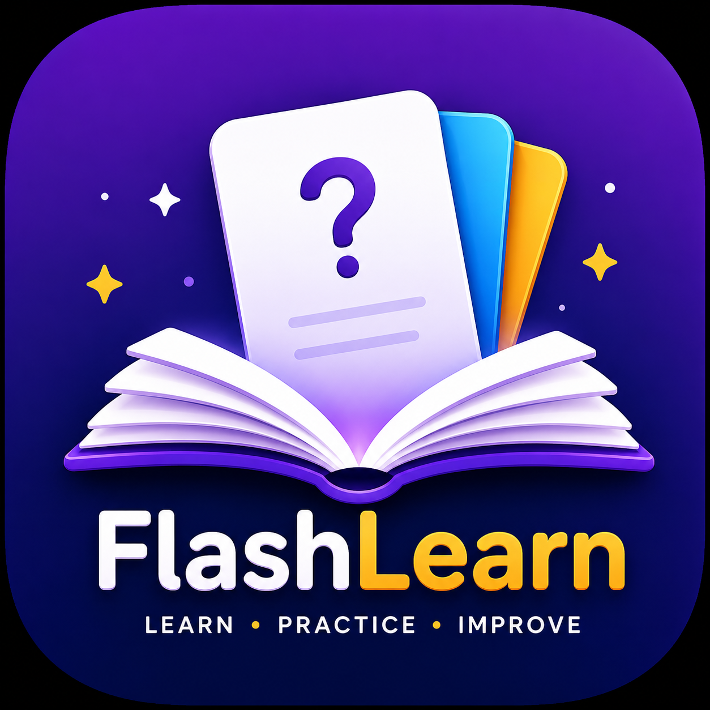

# 📚 FlashLearn

<p align="center">
  
</p>

<h1 align="center">FlashLearn</h1>

<p align="center">
  <strong>Learn • Practice • Improve</strong>
</p>

<p align="center">
  A modern, interactive, and offline-first flashcard and quiz learning application built with Flutter.
</p>

<p align="center">
  <a href="https://github.com/AliZain3311/codealpha-flashcard-quiz">
    
  </a>
  
  
  
  
</p>

---

## 📖 About FlashLearn

**FlashLearn** is a modern Flutter-based flashcard and quiz learning application designed to make studying more interactive, organized, and engaging.

The application provides a complete learning workflow where users can:

- 📚 Create and manage flashcards
- 🗂️ Organize flashcards by category
- 🧠 Study flashcards interactively
- 📝 Take multiple-choice quizzes
- 📈 Track learning progress
- 📊 View quiz performance statistics
- 🕘 Review previous quiz attempts
- 💾 Store learning data locally

FlashLearn follows an **offline-first approach** using **Hive local storage**, allowing important learning information to remain available on the device without requiring an internet connection.

This project was developed as part of my **CodeAlpha App Development Internship**.

---

## 🎯 Project Objective

The main objective of FlashLearn is to provide a simple but powerful digital learning environment that helps users:

- 📚 Create personalized flashcards
- 🗂️ Organize cards using categories
- 🧠 Study flashcards interactively
- 📝 Test knowledge through quizzes
- 📈 Track study progress
- 📊 Monitor quiz performance
- 🕘 Review previous quiz attempts
- 💾 Keep learning data stored locally
- 📱 Continue learning offline

---

# ✨ Key Features

## 🗂️ Flashcard Management

FlashLearn provides complete flashcard management functionality.

- ➕ Add new flashcards
- ✏️ Edit existing flashcards
- 🗑️ Delete flashcards
- 📚 View all flashcards
- 🏷️ Organize cards by category
- 💾 Store flashcards locally
- 🔄 Automatically update learning data

---

## 🧠 Interactive Study Mode

The dedicated Study Mode provides an easy way to review learning material.

Users can:

- Open available flashcards
- Navigate through flashcards
- Review questions and answers
- Track studied cards
- Monitor study progress
- Continue learning without an internet connection

---

## 📝 Interactive Quiz Mode

FlashLearn includes an interactive multiple-choice quiz system designed to test the user's knowledge.

### Quiz Features

- ❓ Multiple-choice questions
- 🔘 Four answer options
- ✅ Correct answer feedback
- ❌ Incorrect answer feedback
- 📍 Question progress indicator
- 🧮 Automatic score calculation
- 🏆 Final quiz result
- 💾 Quiz completion history
- 🔄 Continue learning after quizzes

The application validates the available flashcards before allowing a quiz to begin.

---

# 📊 Quiz Statistics

The Home dashboard includes a dedicated **Quiz Statistics** section.

The statistics are generated from the stored quiz history.

| Statistic | Description |
|-----------|-------------|
| 🏆 **Best Score** | Highest percentage achieved |
| 📈 **Average** | Average percentage across completed quizzes |
| 📝 **Total Quizzes** | Total number of completed quizzes |

These statistics are connected to the locally stored quiz history and update as quiz attempts are completed.

---

# 🕘 Quiz History

FlashLearn stores completed quiz attempts locally.

Each history record can contain:

- 🎯 Score
- 📝 Total questions
- 📊 Percentage
- 📅 Date
- ⏰ Time of the attempt

Users can access their complete quiz history through the application's History interface.

---

# 📈 Learning Progress

The Home dashboard provides a quick overview of the user's learning progress.

It displays:

- 📚 Total flashcards
- ✅ Studied flashcards
- 📈 Overall learning percentage
- 🗂️ Available categories

This allows users to understand their learning progress at a glance.

---

# 💾 Offline-First Storage

FlashLearn uses **Hive** for local data persistence.

### Locally stored information includes:

- Flashcards
- Studied flashcard IDs
- Quiz history
- Quiz scores
- Quiz percentages
- Learning progress

This architecture allows the application's core learning functionality to work without requiring a remote backend.

---

# 🎨 Modern UI / UX

FlashLearn was designed with a clean, modern, and user-friendly visual experience.

### UI Highlights

- 🎨 Modern color scheme
- 🧩 Rounded cards
- ✨ Clean visual hierarchy
- 📊 Progress indicators
- 🔘 Modern buttons
- 🎯 Meaningful icons
- 📱 Mobile-friendly layouts
- ♿ Clear and accessible controls
- 🔔 Success and error feedback
- 🧭 Simple navigation
- 💎 Consistent application theme

The design focuses on keeping the learning experience **simple, focused, and distraction-free**.

---

# 🖼️ Application Branding

FlashLearn includes custom application branding.

### 📱 Custom App Icon

The application uses a dedicated FlashLearn app icon.

### 🚀 Custom Splash Screen

A branded FlashLearn splash screen is displayed when the application starts before opening the main dashboard.

Branding assets are maintained inside:

```text
assets/
├── flashlearn_icon.png
└── flashlearn_splash.png